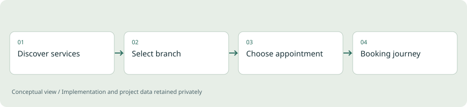
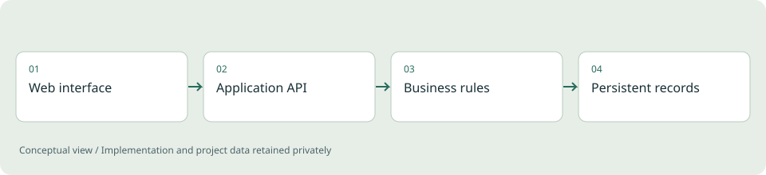
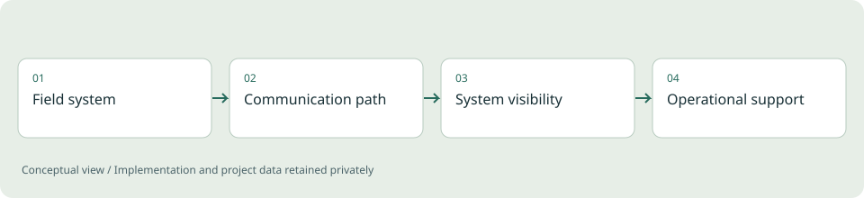
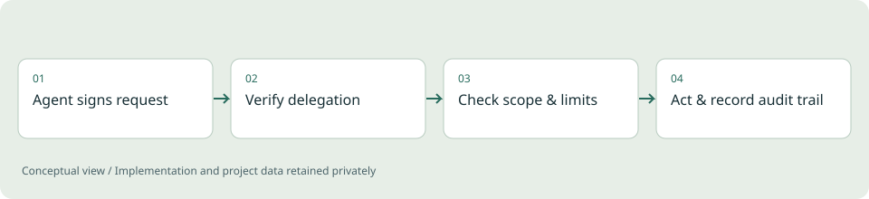

# Divyesh Shama | Engineering Portfolio

**Backend systems, full-stack applications and applied ML.**

Ten case studies explaining the problems, project scope, engineering decisions and limitations behind my work. Implementation source and project data remain private.

[Open the visual portfolio](https://divyeshdevasya.github.io/portfolio/) | [About me](https://github.com/divyeshdevasya)

## [Distributed Telemetry Backend](projects/telemetry.md)

**Backend engineering / Personal reference project**

Exploring how device readings become useful operational information, including what happens when traffic grows or a dependency fails.

Go / Java / Spring Boot / PostgreSQL

[Read the case study](projects/telemetry.md)

## [Motorhome Booking Platform](projects/motorhome.md)

**Full-stack engineering / Demonstration application**

A booking workflow that connects a customer-facing experience with availability and reservation rules.

Node.js / JavaScript / SQLite / HTML & CSS

[Read the case study](projects/motorhome.md)

## [ApplyKit](projects/applykit.md)

**Developer tooling / Python workflow project**

Organizing reusable application work while keeping personal documents separate from the reusable toolkit.

Python / Command-line workflows / Templates

[Read the case study](projects/applykit.md)

## [Barber Booking Experience](projects/barber-next.md)

**Frontend and full-stack / Next.js demonstration**

A service-business website that connects discovery, branch selection and a booking experience.

Next.js / TypeScript / Prisma

[Read the case study](projects/barber-next.md)

## [Service Booking: Frontend to API](projects/barber-fullstack.md)

**Full-stack / React and Python demonstration**

Exploring the boundary between a web interface and the backend that supports a service-booking workflow.

React / TypeScript / FastAPI / PostgreSQL

[Read the case study](projects/barber-fullstack.md)

## [Location-Sequence Research](projects/thesis.md)

**Applied ML / Master's thesis**

Research into symbolic movement representations and the relationship between predictive utility and privacy.

Sequence modeling / Data representation / Evaluation

[Read the case study](projects/thesis.md)

## [Internal Operations & Telemetry](projects/operations.md)

**Professional project / High-level case study**

Connecting operational work and telemetry inspection within an internal application context.

Web workflows / APIs / Data analysis

[Read the case study](projects/operations.md)

## [Charging Connectivity & Commissioning](projects/charging.md)

**Professional project / Systems integration**

Diagnosing communication and observability problems in a charging-system context.

Telemetry / Connectivity / PLC-HMI context

[Read the case study](projects/charging.md)

## [Agent Identity Infrastructure](projects/agent-identity.md)

**Backend engineering / Reference implementation**

Treating an AI agent as an accountable actor while keeping a human or legal entity as the contractual principal.

TypeScript / Fastify / PostgreSQL / Redis / Ed25519 signatures / JWT

[Read the case study](projects/agent-identity.md)

## [Multi-Agent Coder](projects/multi-agent-coder.md)

**Applied ML / Tooling experiment**

A small harness that runs planner, builder and reviewer LLM roles in one coding pipeline with real test feedback.

Python / Multi-provider LLM orchestration / Automated test execution

[Read the case study](projects/multi-agent-coder.md)

---

Diagrams are original conceptual illustrations, not screenshots of employer systems. Research and demo results are distinguished from production claims in each case study.
