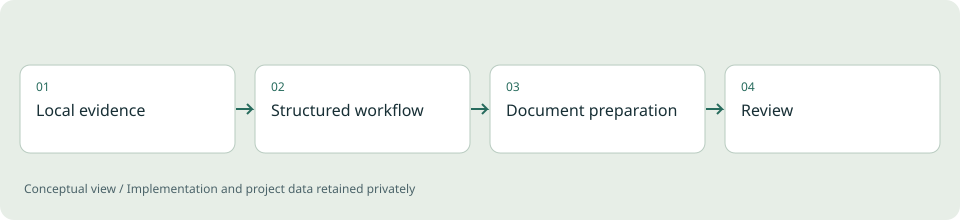

# ApplyKit

**Developer tooling / Python workflow project**

Organizing reusable application work while keeping personal documents separate from the reusable toolkit.

*Illustrative diagram, not a product screenshot or implementation blueprint.*

## Problem

Application preparation involves repeated steps and multiple documents. Mixing personal evidence with reusable logic makes the workflow difficult to maintain and share.

## Project scope

The toolkit provides command-line workflows, reusable templates and a separate local workspace for candidate material. The project demonstrates how file organization and process design can make an everyday workflow more consistent.

**Technical areas:** Python / Command-line workflows / Templates

## Engineering decisions

- Separate personal evidence from the reusable application structure.
- Make the sequence of work understandable through explicit commands and documentation.
- Keep claims tied to supporting information rather than generating unsupported statements.

## Outcome

A reusable Python toolkit and documented workflow. The implementation can be used with different local candidate workspaces.

## Limits and context

The presence of a workflow does not establish recruitment outcomes, and generated material still requires evidence review.

[Back to portfolio](../README.md)
