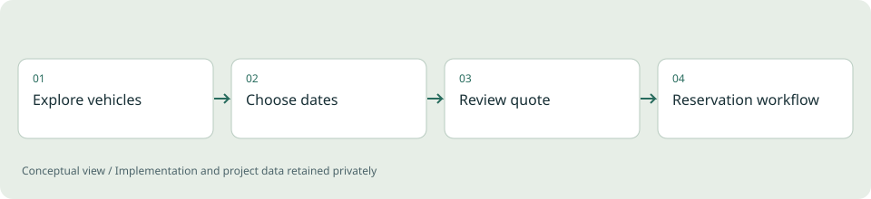

# Motorhome Booking Platform

**Full-stack engineering / Demonstration application**

A booking workflow that connects a customer-facing experience with availability and reservation rules.

*Illustrative diagram, not a product screenshot or implementation blueprint.*

## Problem

A booking interface has to explain availability clearly while keeping dates, quotes and reservation states consistent. An attractive page alone does not solve those operational rules.

## Project scope

The application brings together server-rendered pages, quote calculation, availability checks and persistent booking records. Its demo configuration separates the visible experience from real business contacts, payment credentials and customer information.

**Technical areas:** Node.js / JavaScript / SQLite / HTML & CSS

## Engineering decisions

- Model dates and booking states explicitly.
- Include turnaround time in the operational concept of availability.
- Keep business rules separate from the presentation so changes can be reasoned about.

## Outcome

A complete demonstration of a booking-oriented web application, including the logic behind the customer journey. No revenue or customer-adoption claim is made.

## Limits and context

Live operation requires its own integration and concurrency validation, business configuration and deployment checks.

[Back to portfolio](../README.md)
