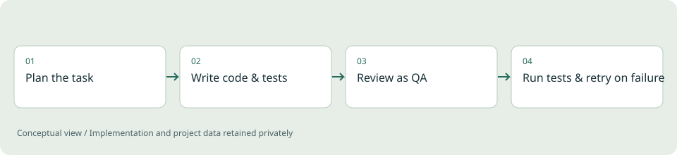

# Multi-Agent Coder

**Applied ML / Tooling experiment**

A small orchestration harness that runs three different LLMs as distinct roles in one coding pipeline: planner, builder, and reviewer.

*Illustrative diagram, not a product screenshot or implementation blueprint.*

## Problem

It's easy to overstate what a "multi-agent" setup adds over asking a chatbot directly. The interesting engineering question is not which vendor's model is used for which role, but what a harness needs to provide before automation is actually worth the extra complexity and cost.

## Project scope

A planner model produces a task plan, a builder model writes code and tests against that plan, and a reviewer model performs a strict QA pass on the resulting diff. The harness writes the generated files to disk, runs the tests, and retries the loop on failure, rather than leaving that mechanical work to a human copying output between chat windows.

**Technical areas:** Python / multi-provider LLM orchestration / automated test execution

## Engineering decisions

- Treat "agent" as harness behavior (file access, test execution, retry-on-failure) rather than as a property of the model itself.
- Give each role a distinct system prompt and keep roles swappable across model providers.
- Only retry automatically on a concrete test failure signal, not on vague dissatisfaction with output.

## Outcome

A working command-line pipeline that takes a natural-language task, produces code and tests, and can retry based on real test results, with a small standalone webpage-summarization utility built alongside it during development.

## Limits and context

This is a demonstration harness, not a production coding-agent product. It does not do repository-scale change management, and correctness still depends on human review of the generated diff.

[Back to portfolio](../README.md)
