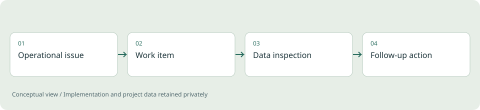

# Internal Operations & Telemetry

**Professional project / High-level case study**

Connecting operational work and telemetry inspection within an internal application context.

*Illustrative diagram, not a product screenshot or implementation blueprint.*

## Problem

Operational teams need to move between work items and the information that helps them investigate an issue. Disconnected tools make that workflow harder to follow.

## Project scope

The existing portfolio describes operational ticket workflows, data handling and a telemetry dashboard module. The engineering discussion centers on how interfaces, APIs and stored records support the same workflow.

**Technical areas:** Web workflows / APIs / Data analysis

## Engineering decisions

- Connect work items with the information needed to investigate them.
- Make different user workflows understandable within one application.
- Distinguish operational features from simulation and prototype exploration.

## Outcome

The existing portfolio reports practical internal use. Quantified business impact and independent usage verification are not claimed in this public case study.

## Limits and context

Employer implementation, internal screens, customer records and detailed deployment information remain private. CAN/vCAN and smartwatch exploration were described as prototype or test work.

[Back to portfolio](../README.md)
