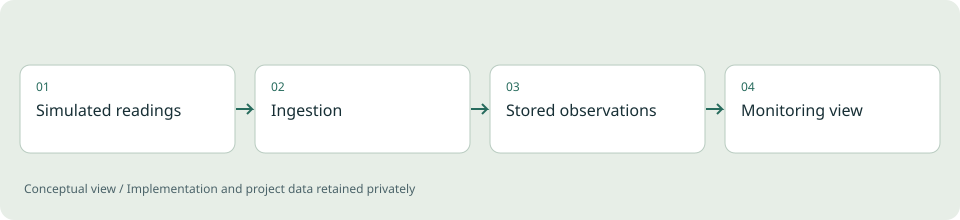

# Distributed Telemetry Backend

**Backend engineering / Personal reference project**

Exploring how device readings become useful operational information, including what happens when traffic grows or a dependency fails.

*Illustrative diagram, not a product screenshot or implementation blueprint.*

## Problem

Device data arrives continuously, while people need a coherent view of recent readings and system state. Ingestion, storage and presentation each have different failure modes.

## Project scope

The reference project separates ingestion, application APIs and persistent storage, and includes a browser dashboard and monitoring configuration. It uses simulated devices so the engineering behavior can be discussed without exposing an employer system.

**Technical areas:** Go / Java / Spring Boot / PostgreSQL

## Engineering decisions

- Keep capacity limits explicit so overload can be observed and handled.
- Treat duplicate readings and temporary downstream failures as normal engineering cases.
- Balance freshness against the cost of processing small messages individually.

## Outcome

A personal system for exploring telemetry flow and failure behavior. It is a demonstration, not evidence of a production throughput or uptime claim.

## Limits and context

Production readiness would require environment-specific load tests, recovery exercises and delivery-guarantee verification.

[Back to portfolio](../README.md)
